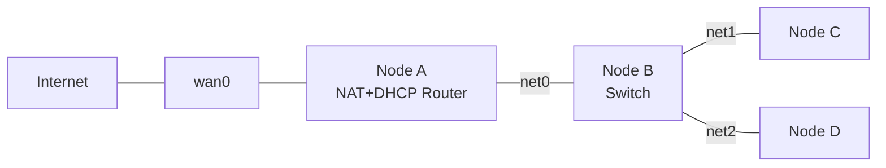

# DHCP Configuration and Network Address Translation (NAT)

**Topic:** Assigning IP addresses via DHCP and configuring one node as a NAT router in order to share a single public IP address among multiple hosts in a private subnet.

## Topology

## What I Did

1. Instead of assigning IP addresses manually like last time, I used the **Dynamic Host Configuration Protocol (DHCP)**. The address assignment follows the DORA process: Discover, Offer, Request, Acknowledge. The DHCP server was configured using **Kea DHCP**, where I defined the subnet, address pool, and default gateway option.

2. Analyzed the DORA packets in **Wireshark** via SSH remote capture to understand what information is exchanged between client and server.

3. Configured Node A as a NAT router for the private subnet consisting of Nodes B, C and D. Using **nft (nftables)**, I created a NAT table with two chains — one for **SNAT** (Source NAT, postrouting) and one for **DNAT** (Destination NAT, prerouting).

4. **Postrouting (SNAT):** When a packet leaves the private subnet towards the internet, the private source IP address is replaced by the public WAN IP address of Node A. The rule matches on both the incoming and outgoing interface to avoid applying NAT to traffic that stays local.

5. **Prerouting (DNAT):** For incoming traffic from the internet towards the private subnet, I configured port forwarding — incoming HTTP packets on the WAN interface are redirected to a specific node in the private subnet. The rule matches on the destination port specified in the TCP header to identify HTTP traffic.

## Tools Used

- `ip` — interface configuration and routing
- `nft` — NAT table and chain configuration
- `tcpdump` — packet capture on remote nodes
- **Wireshark** — packet analysis via SSH remote capture
- **Kea DHCP** — DHCP server configuration
- `systemd-networkd` — DHCP client configuration on nodes

## Challenges

- Wireshark remote capture via SSH requires careful attention to filter syntax — what works in one tool doesn't necessarily work in another
- SSH host key changes on the testbed caused connection issues that needed to be resolved before capturing traffic
- The DHCP server service was running on all nodes by default, which caused unexpected behavior on client nodes

## Why NAT?

The IPv4 address space has been exhausted. The problem is the limited number of **public** IP addresses — private addresses don't count since they're not globally unique and can be reused across different private networks. NAT solves this by allowing all hosts in a private subnet to share a single public IP address (the one assigned to the WAN interface of their router).
